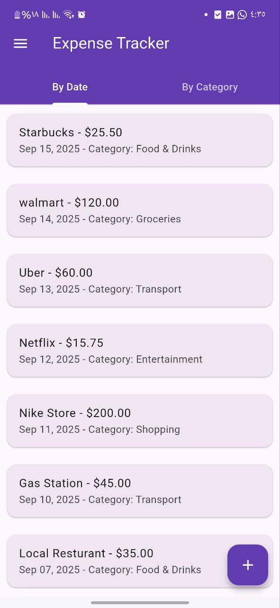
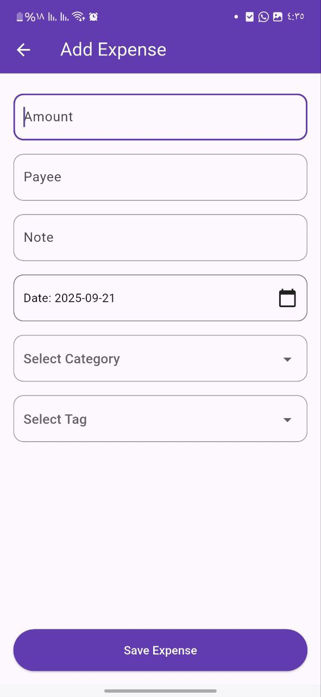
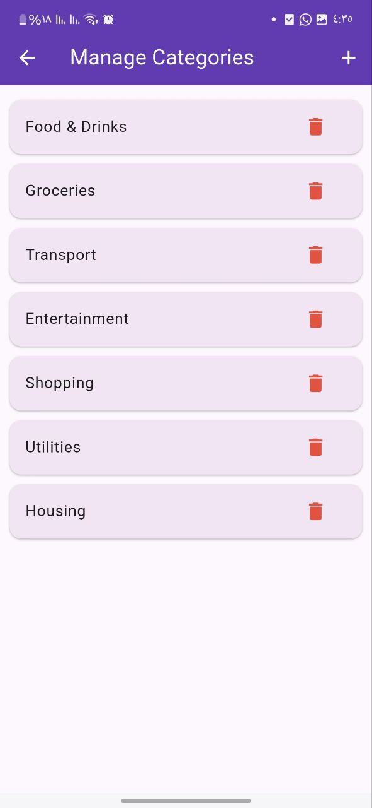
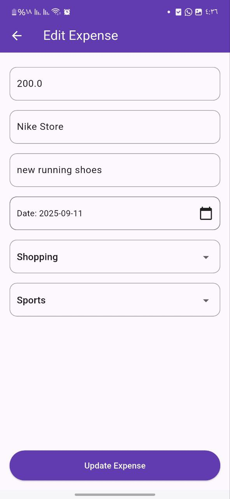
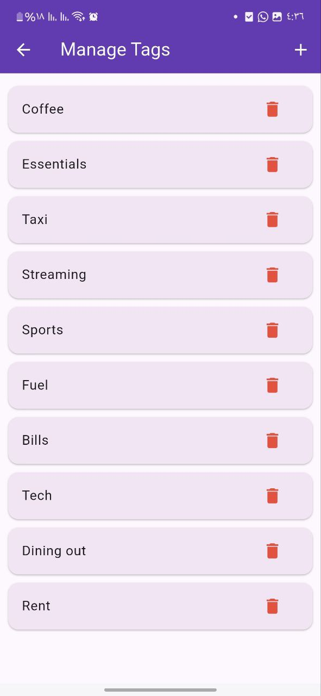

# 💰 Expense Manager App

A clean and simple and test-driven Flutter application to track your expenses, categories, and tags, built with Clean Architecture and Provider state management.

---

## ✨ Features

- 🧾 Add, edit, and delete expenses.
- 📂 Organize expenses into categories.
- 🏷️ Tag your expenses with custom tags.
- 💾 Offline support with persistent local storage.
- 📊 View all your expenses neatly categorized.
- 🎨 Modern Material Design UI with smooth interactions.

---

## 🧱 Architecture

- 🧼 **Clean Architecture** with `core`, `features`, `data`, `domain`, and `presentation` layers.
- 🗂️ Repository pattern to separate concerns.
- 🛠️ **Provider** for state management.
- 💾 **Local Storage** to store data.
- ✅ Designed for scalability and maintainability.
- ✅ **Test-Driven Development (TDD)** for all business logic using:
    - `mockito`
    - `bloc_test`

---

## 📷 Screenshots

| Home | Add Expense | Categories |
|------|-------------|------------|
|  |  |  |

| Home Grouped By Categories | Edit Expense | Tags |
|----------------------------|--------------|------|
|  |  |  |

---

## 🚀 Getting Started

1. **Clone the repo:**
   ```bash
   git clone https://github.com/muneeralkanafani/expenses_manager.git
   cd expenses_manager
